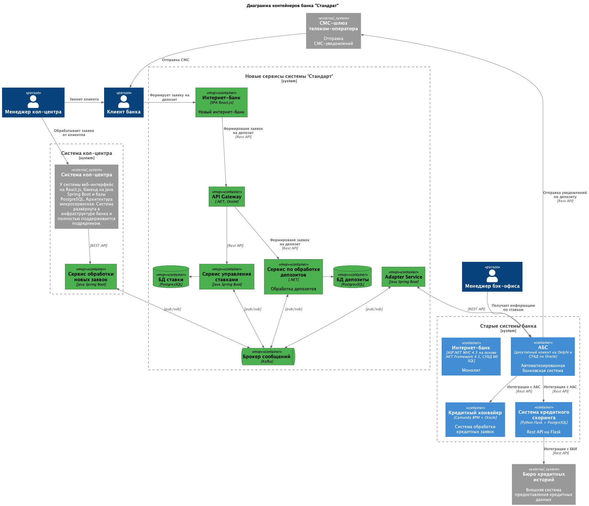

### **Название задачи:**  Открытие депозитов онлайн
### **Автор:** Архитектор
### **Дата:** 14.11.2025
### **Функциональные требования**
Опишите здесь верхнеуровневые Use Cases. Их нужно оформить в виде таблицы с пошаговым описанием:

|**№**|**Действующие лица или системы**|**Use Case**|**Описание**|
| :-: | :- | :- | :- |
|UC1|Новый клиент|Подача заявки на депозит через сайт| 1. Заходит на сайт банка.  2. Просматривает список доступных депозитов с актуальными ставками.  3. Заполняет форму заявки на депозит, указав свой номер телефона и Ф.И.О.  4. Подает заявку на депозит.  5. Ожидает звонка от менеджера кол-центра.   |
|UC2| Клиент банка| Подача заявки на открытие депозита через интернет-банк| 1. Заходит в интернет-банк.  2. Просматривает список доступных депозитов с актуальными ставками и персонализированные ставки лично для него.  3. Заполняет форму заявки на депозит, указав счет и сумму депозита.  4. Подтверждает операцию с помощью СМС-кода.  5. Подает заявку на депозит.  6. Получает СМС-уведомление о подтверждении размера ставки и открытия депозита.
|UC3| Менеджер кол-центра | Обработка заявки на открытие депозита с сайта | 1. Обрабатывает заявку на открытие депозита клиента банка.   2. Изучает заявку в системе кол-центра.   3. Подготавливает условия по депозиту (возможно, особые).   4. Звонит клиенту и предлагает условия по депозиту.   5. Назначает встречу в отделении банка.
### **Нефункциональные требования**
Опишите здесь нефункциональные требования и архитектурно значимые требования.

|**№**|**Требование**|
| :-: | :- |
| R   | Надёжность (Reliability)           |
| R1  | Все сервисы должны работать 24/7 и быть доступны в 99,9%|
| R2  | Шифрование трафика при передаче данных с сайта|
| R4  | Надежная доставка СМС-уведомлений|
| P   | Производительность (Performance)   |
| P1  | Равномерное горизонтальное масштабирование и распределение запросов между серверами, приложениями и ЦОД |
| P2  | Отклик по всем операциям должен быть максимально быстрым и занимать миллисекунды| 
|P3 | Система должна выдерживать большую нагрузку от онлайн-заявок, что требует защиты АБС от перегрузки.|
| S   | Поддерживаемость (Supportability)  |
| S1  | Использовать технологии, которые уже есть в банке (MS SQL и Oracle PostgresSQL) |
| S2  | Совместимость с существующими платформами разработки|
| S3  | Новые технологии должны быть понятны сотрудникам на уровне языков программирования |
| S4  | Микросервисная архитектура для новых компонентов |
| S5  | Разработка документации |
| S6  | Брокер сообщений -- Kafka|
| +R  | + Ограничения (Restrictions)       |
| +R1 | Разделение доступа между сотрудниками депозитов и кредитов |
| +R3 | АБС может масштабироваться только вертикально|
| +R4 | Несовместимость текущей платформы интернет-банка с Kafka            |
| +R5 | Синхронизация данных между системами раз в сутки            | Ограничение текущей интеграции АБС и кредитного конвейера
| +R6 | Ограниченные возможности доработки ядра интернет-банка            | Разработку ведет подрядчик
### **Решение**

Приведите диаграммы контекста и контейнеров в модели C4. Опишите там основные компоненты и интеграции всех элементов решения. 

**Интернет-банк (SPA)**: Новый интернет-банк реализован на React.js так как есть экспертиза у команды. (R1, S1, S3, +R6)

**API Gateway**: Обеспечивает единую точку входа запросов от SPA. Маршрутизация запросов, авторизация, безопасность. Реализовн на знаком языке программирования .NET. (R2, S3, S2, +R1)

**Сервис по обработке депозитов**: Отвечает за обработку заявок по депозитам. Реализовн на знаком языке программирования .NET, использует свою БД PostgresSQL. (P2, S4) 

**Сервис управления ставками**: Сервис управления ставками. Уход от XLS файлов. (S4)

**Adapter Service**: Промежуточный слой для интеграции АБС с новыми сервисами. Разгружает АБС. (+R3, S3, S4)

**Брокер сообщений (Kafka)**: Асинхронное взаимодействие между новыми сервисами. Это позволит обеспечить необходимую отказоустойчивость даже при высоких нагрузках. (P3, S6, +R3)

**Сервис обработки новых заявок** : Обработка входящих заявок поступающих от кол-центра

### **Альтернативы**
1. Адаптация текущей АБС
* Весь новый функционал реализовывать в АБС
* Причиная отказа: АБС будет сильно нагружаться, а масштабировать АБС можно только вертикально.
2. Не использовать Kafka
* Снижается отказоустойчивость: в случае недостпуности системы заявка от клиента может потеряна. Кафка гарантирует доставку сообщений.

**Недостатки, ограничения, риски**
* Микросервисная архитектура усложняет систему: требуется управляеть распределенными транзакциями (согласованность данных), усложняется процесс локального развертывания системы для разработки и отладки.
* Накладываются дополнительные задержки при асинхронных взаимодействиях.
* Adapter Service выступает потенциальной точкой отказа системы (его недоступность приведет к неработоспособности всей системы)

