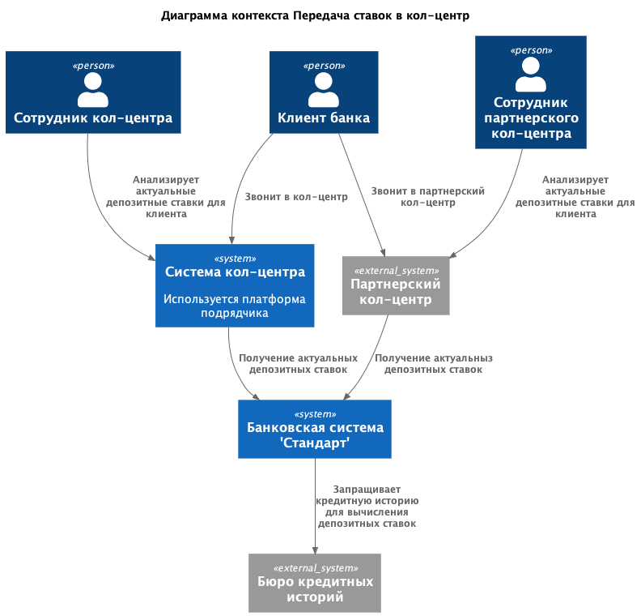
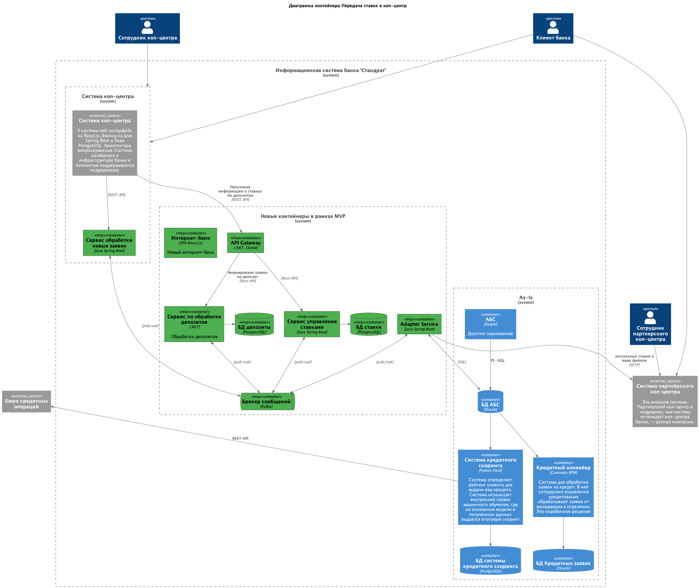

### **Название задачи:**  Передача ставок в кол-центр
### **Автор:** Архитектор
### **Дата:** 16.11.2025
### **Функциональные требования**
Опишите здесь верхнеуровневые Use Cases. Их нужно оформить в виде таблицы с пошаговым описанием:

|**№**|**Действующие лица или системы**|**Use Case**|**Описание**|
| :-: | :- | :- | :- |
|US1|Сотрудник кол-центра|Консультация клиента|1. Сотрудник кол-центра отвечает на входящих звонок от клиента  2. Сотрудник кол-центра анализирует актуальный список депозитных ставок для клиента  3. Консультирует клиента по актуальным депозитным ставкам |
|US2|Сотрудник партнерского кол-центра|Консультация клиента|1. Сотрудник партнерского кол-центра отвечает на входящих звонок от клиента  2. Сотрудник партнерского кол-центра анализирует актуальный список депозитных ставок для клиента, который получают по протоколу SFTP от банковской системы.  3. Консультирует клиента по актуальным депозитным ставкам|
### **Нефункциональные требования**
Опишите здесь нефункциональные требования и архитектурно значимые требования.

|**№**|**Требование**|
| :-: | :- |
|R1|Синхронизация депозитных ставок не реже раз в сутки|
|R2|Передача файлов через SFTP|
|R3|Шифрование данных|
|+R1|У партнерского кол-центра нет возможности делать API вызовы. |
### **Решение**

Adapter Service отвечает за синхронизацию ставок (не реже раз в сутки) и отправку файлов SFTP для партнерского кол-центра.

### **Альтернативы**

Отправка файлов по SMTP как было раньше. В этом случае не исключается человесеский фактор, так как отправку писем делат сотрудник банка.

**Недостатки, ограничения, риски**

* Синхронизация файлов раз в сутки.
* Риск перегерузки кол-центра.
* Риск сбоя при передачи больших файлов.

