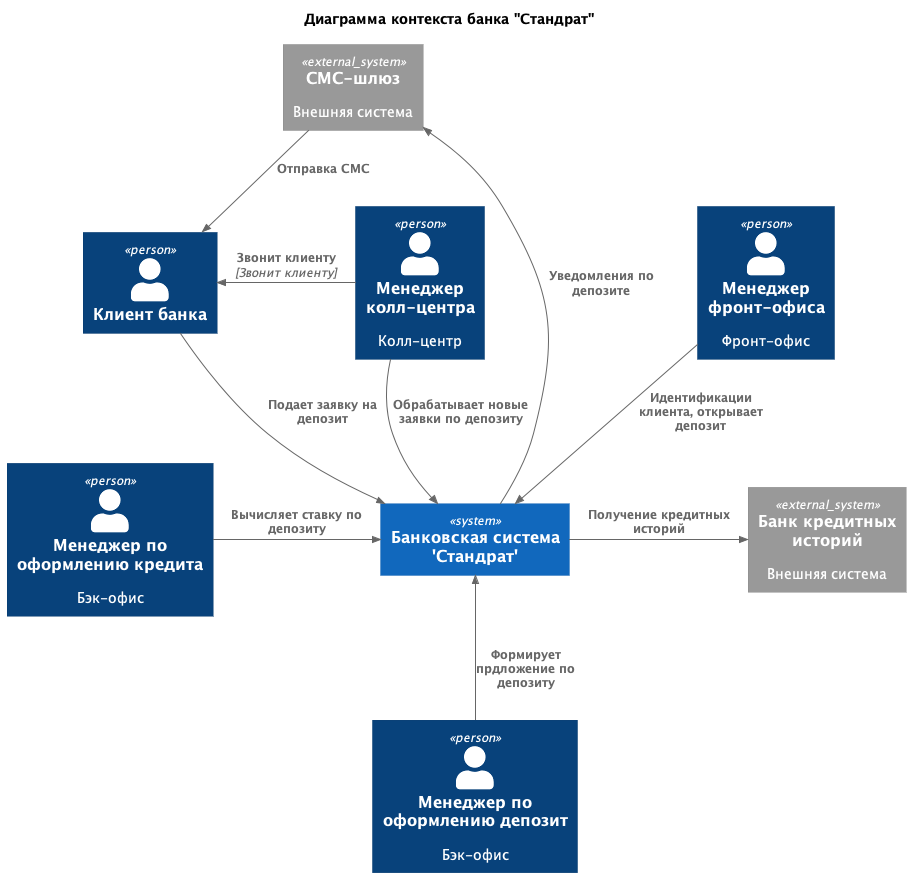
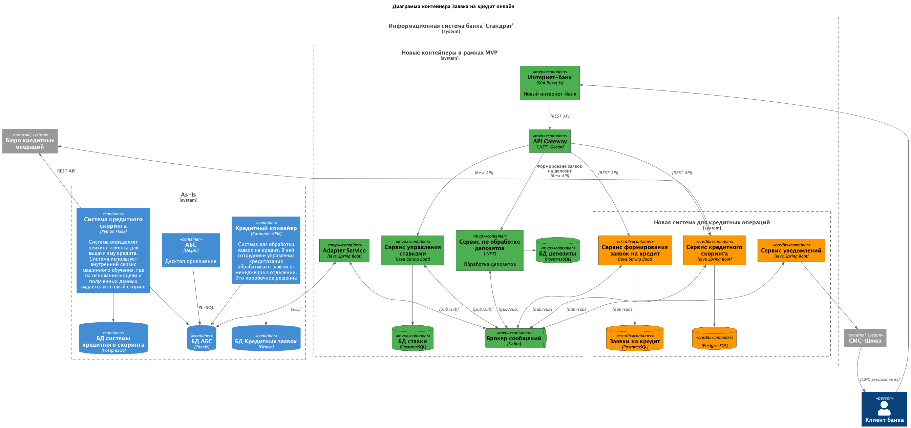

### **Название задачи:** Заявка на кредит онлайн
### **Автор:** Архитектор
### **Дата:** 16.11.2025
### **Функциональные требования**
Опишите здесь верхнеуровневые Use Cases. Их нужно оформить в виде таблицы с пошаговым описанием:

|**№**|**Действующие лица или системы**|**Use Case**|**Описание**|
| :-: | :- | :- | :- |
|UC1|Новый клиент банка|Подача заявки на кредит|1. Клиент видит предложение открыть кредит по некоторой ставке.  2. Клиент может сформировать заявку на кредит, указав свои ФИО, телефон и паспортные данные.  3. Клиенту приходит СМС о том, что нужно прийти в отделение для получения кредита и идентификации|
|UC2|Существующий клиент банка.   **Система:** Новый интернет-банк|Подача заявки на кредит| 1. Клиент авторизуется в интернет-банке.  2. Клиент видит список доступных кредитов с актуальными условиями так же, как и на сайте. Но ещё ему может выводиться предодобренное предложение по кредиту.  3. Подает заявку на кредит, указав банковский счет и подтвердив операцию СМС-кодом   4. Заявка проходит вновь через кредитный конвеер.   5. При изменении статуса заявки на кредит приходит СМС уведомление клиенту.
### **Нефункциональные требования**
Опишите здесь нефункциональные требования и архитектурно значимые требования.

|**№**|**Требование**|
| :-: | :- |
| R1  | Все сервисы должны работать 24/7 и быть доступны в 99,9%| 
| P1  | Отклик по всем операциям должен быть максимально быстрым и занимать миллисекунды|
| P2  |Обработка заявок на кредит в течение рабочего дня
| P3  | Равномерное горизонтальное масштабирование и распределение запросов между серверами, приложениями и ЦОД | Подготовка к росту нагрузки от новых клиентов             |
| S1  | Брокер сообщений -- Kafka                               
### **Решение**

Переход на микросервисную архитектуру, а именно выделены следующие сервисы:
* Ceрвис формирование заявок на кредит
* Сервис управления ставками (отказ от XLS файлов)
* Сервис уведомлений

Интеграция между сервисами происходят с помощью Kafka. 
Решение полностью покрывает все функциональные и нефункциональные требования. 
### **Альтернативы**
1. Интеграция с существующим Кредитным конвейером и скорингом.
* Минусом такго подхода сильная связанность.
2. Интеграция с АБС
* Причиная отказа: АБС будет сильно нагружаться, а масштабировать АБС можно только вертикально.

**Недостатки, ограничения, риски**

* Микросервисная архитектура усложняет систему: требуется управляеть распределенными транзакциями (согласованность данных), усложняется процесс локального развертывания системы для разработки и отладки.
* Накладываются дополнительные задержки при асинхронных взаимодействиях.

